<div align="center">
	
	<h1>Ani Portfolio Allocation</h1>
	<p><strong>Track • Allocate • Visualize • Project Returns</strong></p>
	<p>An opinionated, lightweight personal portfolio allocation dashboard built with <a href="https://angular.dev/">Angular 20</a>, <a href="https://primeng.org/">PrimeNG</a>, <a href="https://www.anychart.com">AnyChart</a> and a <a href="https://firebase.google.com/">Firebase</a> backend.</p>
	<p>
		<a href="https://angular.dev/">
			
		</a>
		<a href="https://www.typescriptlang.org/">
			
		</a>
		<a href="https://firebase.google.com/">
			
		</a>
		<a href="#-license">
			
		</a>
	</p>
	<p>
		<a href="#features">Features</a> •
		<a href="#quick-start">Quick Start</a> •
		<a href="#screenshots">Screenshots</a> •
		<a href="#usage">Usage</a> •
		<a href="#architecture">Architecture</a> •
		<a href="#contributing">Contributing</a>
	</p>
</div>

---

## ✨ Overview

Ani Portfolio Allocation helps you understand how your investments are distributed, what each category contributes, and what your weighted expected returns look like over time. It combines allocation management, categorization, expectation modeling, and net worth trend visualization into a single clean UI.

| Core Value              | Description                                                            |
| ----------------------- | ---------------------------------------------------------------------- |
| Allocation Transparency | See how capital is split across asset categories.                      |
| Expectations Engine     | Weighted expected return calculation with per‑category assumptions.    |
| Change Tracking         | Synthetic or real historical snapshots displayed as a net worth curve. |
| Mock-Friendly           | Develop fully offline without Firebase by flipping one flag.           |

---

## 🚀 Features

- 📊 Interactive allocation charts (category drill-downs)
- 🗂️ Category management with editable expected returns
- 📈 Net worth trend visualization with generated or real change history
- 🔁 Weighted expected annual return & absolute return projection
- 💾 In‑memory mock mode (no backend required) for instant onboarding
- 🔐 Firebase integration for auth + persistence (flag controlled)
- 🎨 Theming with PrimeNG + custom dark preset (`preset-lara-dark-blue`)
- ⚡ Modern Angular 20 standalone component architecture style readiness

---

## 📷 Screenshots

> The UI below represents mock data. Images are in `docs/`.

Order: Dashboard → Manage → Allocation → Categories → Expectations.

| Dashboard                                     | Manage                                     | Allocation                                                              |
| --------------------------------------------- | ------------------------------------------ | ----------------------------------------------------------------------- |
|  |  |  |

| Categories                                     | Expectations                                     | Net Worth Trend                                   |
| ---------------------------------------------- | ------------------------------------------------ | ------------------------------------------------- |
|  |  |  |

| Manage (Edit)                                   |
| ----------------------------------------------- |
|  |

> For full resolution open the images directly in the `docs` directory.

---

## 🧩 Tech Stack

| Layer      | Tooling                              |
| ---------- | ------------------------------------ |
| Framework  | Angular 20 (CLI)                     |
| UI         | PrimeNG, PrimeFlex, Prime Icons      |
| Charts     | AnyChart                             |
| State / Rx | Built-in services + RxJS             |
| Backend    | Firebase (Auth, Firestore)           |
| Mocking    | In-memory service implementations    |
| Tooling    | ESLint, TypeScript 5, Angular ESLint |

---

## 🗺️ Project Structure

```
src/
	app/
		components/        # Feature components (allocation, expectations, charts, tables)
		services/          # Auth + portfolio + mocks
		models/            # Portfolio / category interfaces
		utils/             # Pipes & nav items
		theme/             # Custom theme preset
	assets/              # Images & static assets
	environments/        # Environment flags (mocks, production)
docs/                  # Screenshots
```

---

## ⚙️ Configuration

Mock mode is controlled via `environment.useMocks` and is intended solely for local/offline development when Firebase credentials or connectivity are unavailable.

```ts
// src/environments/environment.ts
export const environment = { production: false, useMocks: true };
```

Set `useMocks: false` (default for production builds) to enable real Firebase initialization (you must configure Firebase separately – credentials are intentionally not stored here).

### What Mock Mode Does

- Skips Firebase initialization
- Provides `AuthService` & `PortfolioService` via mock implementations
- Seeds allocation, categories and generated historical change points (`mock-portfolio.service.ts`)

---

## 🧮 Weighted Expectation Logic (Simplified)

The expectations engine computes per‑category weightage and aggregates weighted expected returns.

```mermaid
flowchart LR
	A[Portfolio Items] -->|group by category| B[Category Buckets]
	B --> C[Sum Values]
	C --> D[Compute Category Weightage %]
	D --> E[Expected Return per Category]
	E --> F[Weighted Exp Return Σ]
	F --> G[Overall Expected Annual Return]
```



Formula snippet:

```
weightage(category) = value(category) / total_portfolio_value * 100
weighted_expected(category) = weightage(category) * expected_return(category) / 100
overall_weighted_expected = Σ weighted_expected(category)
```

---

## � Firebase Setup

The application expects a Firebase project for production runtime (auth + data persistence).

### 1. Create Firebase Project

1. Visit <https://console.firebase.google.com/>
2. Create a new project (skip Google Analytics if not needed)
3. Enable Authentication (e.g., Google Login) as user auth is required
4. Create Firestore database in Production mode

### 2. Register Web App

Add a Web App in Project Settings → General → Your Apps → Web.

Copy the generated config:

```ts
export const firebaseConfig = {
  apiKey: "...",
  authDomain: "...",
  projectId: "...",
  storageBucket: "...",
  messagingSenderId: "...",
  appId: "...",
};
```

Integrate via AngularFire in an initialization module or `main.ts` once real services are implemented.

### 3. Firestore Rules (Users Scoped)

Minimal example (already in `firestore.rules`):

```
rules_version = '2';
service cloud.firestore {
	match /databases/{database}/documents {
		match /users/{userId}/{documents=**} {
			allow read, write: if request.auth != null && request.auth.uid == userId;
		}
	}
}
```

Deploy rules:

```bash
firebase deploy --only firestore:rules
```

### 4. Local Emulator (Optional)

```bash
firebase emulators:start --only firestore,auth
```

### 5. Production Build & Deploy

```bash
npm run build
firebase deploy
```

### 6. Switching Off Mocks

Set `useMocks: false` and ensure Firebase modules + real services are wired.

---

## �🔧 Quick Start

### 1. Clone

```bash
git clone <your-fork-url> ani-portfolio-allocation
cd ani-portfolio-allocation
```

### 2. Install

```bash
npm install
```

### 3. Run (Mock Mode Enabled by Default)

```bash
npm start
```

Visit: http://localhost:4200

### 4. Preview Production Build (Local Hosting Channel)

```bash
npm run build
npm run preview
```

### 5. Deploy (Firebase Hosting)

```bash
npm run build
npm run deploy
```

---

## 📘 Usage

| Action                     | How                                                                                 |
| -------------------------- | ----------------------------------------------------------------------------------- |
| Add / Edit Allocation Item | Use Manage / Allocation view (mock data stored in-memory)                           |
| Change Expected Returns    | Edit category expected % in Categories view                                         |
| View Weighted Return       | Open Expectations page (shows per‑category + total)                                 |
| Inspect Net Worth Trend    | Net Worth Graph page (generated series in mock mode)                                |
| Switch to Real Backend     | Set `useMocks: false` (already the prod expectation) and configure Firebase modules |

### Extending Portfolio Data Persistence

1. Disable mocks (`useMocks: false`).
2. Provide Firebase config & initialize AngularFire modules.
3. Implement real `PortfolioService` CRUD using Firestore.
4. Map Firestore docs to existing model interfaces.

---

## 🧹 Linting & Formatting

```bash
npm run lint
```

ESLint is configured via `eslint.config.js` (flat config). Adjust rules as needed.

---

## 📦 Build Artifacts

```bash
npm run build
```

Outputs production bundle to `dist/ani-portfolio-allocation/` (Angular CLI default). Deployed by Firebase Hosting script.

---

## 🤝 Contributing

1. Fork the repository
2. Create a feature branch: `git checkout -b feat/awesome-thing`
3. Commit changes: `git commit -m "feat: add awesome thing"`
4. Push branch: `git push origin feat/awesome-thing`
5. Open a Pull Request

### Commit Conventions

Follow conventional commits (`feat:`, `fix:`, `chore:`, `docs:` etc.) to keep history clean.

### Code Style

- Prefer strongly typed interfaces in `models/`
- Keep services lean and observable-based
- Avoid premature abstraction until a pattern repeats ≥3 times

---

## 🪪 License

Licensed under the MIT License. See `LICENSE` for details.

---

## 🙋 Support / Questions

Open an issue for feature requests or questions. PRs welcome!

---

## ✅ At a Glance

| Category | Value                                   |
| -------- | --------------------------------------- |
| Stack    | Angular + PrimeNG + AnyChart            |
| Mode     | Mock by default (flip flag for backend) |
| Focus    | Allocation insight & expected returns   |
| Deploy   | Firebase Hosting                        |

---

Made with ❤️ to simplify personal portfolio clarity by **Aniruddha Sadhukhan**.
